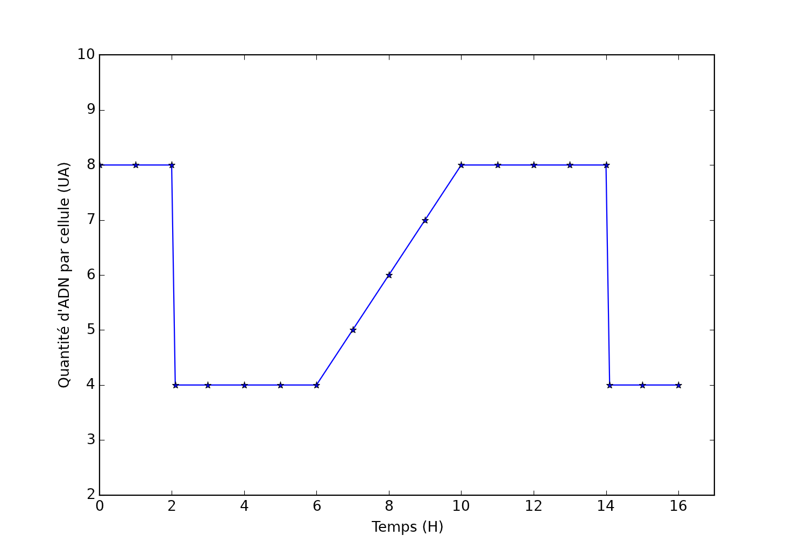

# La conservation du caryotype et de l’information génétique au cours des cycles cellulaires

Le développement d’un être vivant pluricellulaire à partir d’une cellule oeuf nécessite une succession de divisions cellulaires appelées mitoses ainsi que la différenciation des cellules en types cellulaires spécifiques des organes qu’elles constituent. Les molécules d’ADN, constituant principal des chromosomes et support de l’information génétique, sont intégralement transmises au cours de la mitose de la cellule mère aux deux cellules filles. Toutes les cellules de l'organisme possèdent donc le même caryotype et la même information génétique.

Comment la mitose et la réplication permettent elles la reproduction conforme de la cellule ?

Le cycle cellulaire est l’ensemble des modifications qui affectent une cellule entre sa naissance (par division d’une cellule mère pré-existante), jusqu’à sa propre division.

Les [mesures](https://ipfs.io/ipfs/QmaEerNc9isnYPmmzHuac3NPSTC6g8eyzXv1Q2LuBgqy8N) de la quantité d’ADN par cellule au cours du temps permettent de [représenter graphiquement](https://ipfs.io/ipfs/QmUohw7WwJsRHWSyG2Mpbvo6ZPTjcpdZqzLWWjpoukZL7B) ses variations. Exploitez ce graphique pour émettre une hypothèse relative au problème posé. Repérer ensuite les phases G1, S, G2, M sur votre graphique.

  

